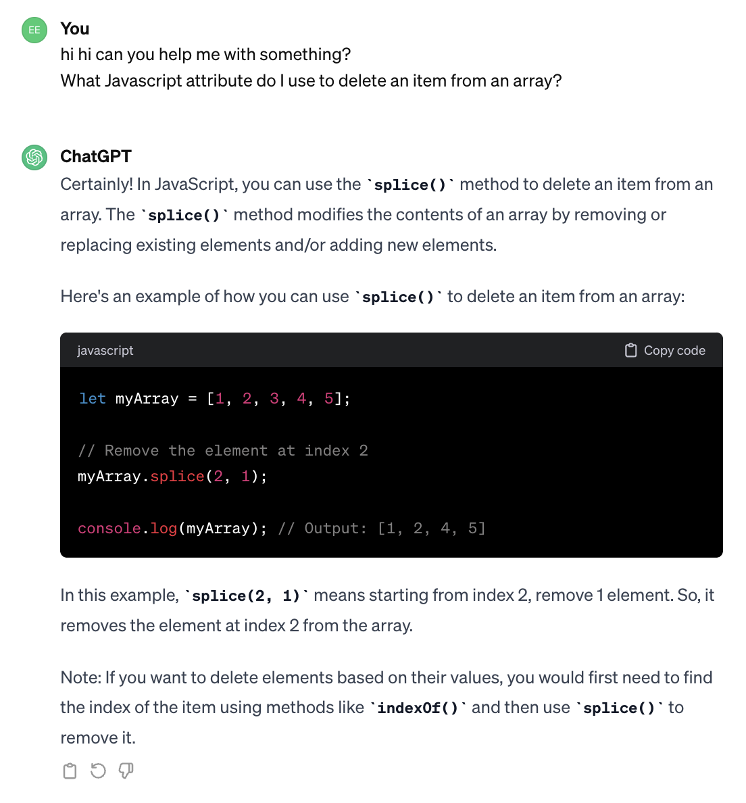
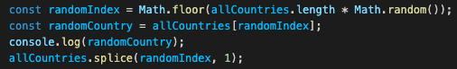
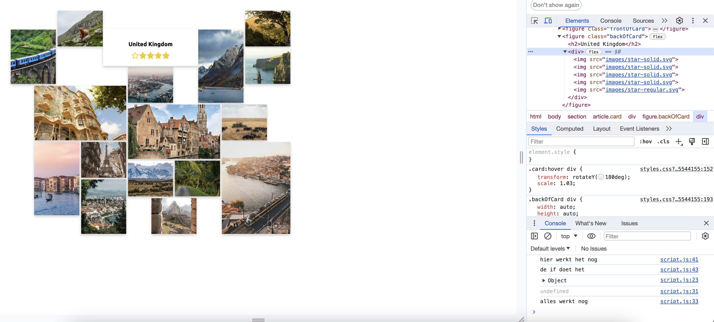
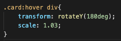
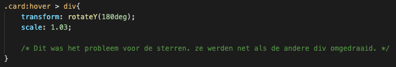

# herkansing-WAFS
nieuwe nette code voor de herkansing van WAFS

## mini procesverslag
Een nieuwe repository, een nieuwe README :)

Zelfs na ons gesprekje van vrijdag 16 feb, vond ik het nog steeds lastig om de javascript code te schrijven voor de kaartjes. 
Toch is het me bijna zonder hulp gelukt en ik ben daar echt heel erg blij mee. Ik heb al meteen iets meer vertrouwen in de rest van de minor. 

### pijnpuntjes
Ik kwam wel een aantal probleempjes tegen:
* Ik had geen idee wat de methode was om een item uit een array te krijgen. Ik kon het niet echt vinden op google dus vroeg ik de volgende prompt aan chatGPT: 
***What Javascript attribute do I use to delete an item from an array?***

vanuit daar heb ik op mdn splice opgezocht en een beetje zitten proberen en gelukkig lukte het na een tijdje.

* Een ander probleem dat ik had was het schrijven van de if statement in de forEach funcie. Ik wist niet precies welke condition ik mee moest geven. Ik wist dat het iets moest zijn als blabla.rating,    maar ik wist niet meteen wat op de plek van blabla moest komen te staan. Eerst had ik bedacht dat ik de rating van de landen wilde hebben dus allCountries.rating, maar dit werkte niet. Uiteindelijk had ik nog even mijn vorrige code bekeken en zag ik dat de condition waarschijnlijk voor specifieker moest zijn, dus keek ik terug in mijn code en zag ik dat het randomCountry.rating moest zijn. Gelukkig werkte het zoen wel.
* Het laatste dingetje dat niet helemaal goed ging waren de sterren. Ik kreeg ze wel in de aangemaakte div, maar om de een of andere reden kwamen de lege sterren voor de gevulde sterren te staan. Dit was niet het geval als ik keek in de inspector.

Ik had het opgelost met row-reverse op de div waar de sterren in staan, maar dit leek me niet de meeste elegante oplossing. Het leek niet een probleem te zijn in de javascript dus ik heb nog even rondgekeken en het lag aan een stukje css styling dat niet geen specifieke selector had.

* Ik heb nu weer 1 grote functie en ik ging proberen om die uit elkaar te halen, maar toen liep ik tegen een probleem aan. Ik had in de ene functie allemaal variabele aangemaakt, die ik daarna in de andere functie niet meer kon gebruiken. Ik weet niet helemaal hoe dat dan moet doen. Dat ga ik proberen uit te zoeken. 

### reflectie 
Ik heb al mijn pijnpuntjes kunnen oplossen zonder om hulp te moeten vragen, dus dat voelt heel goed.
Ik heb hier nu al heel veel van geleerd dus ik ben helemaal blij! 

